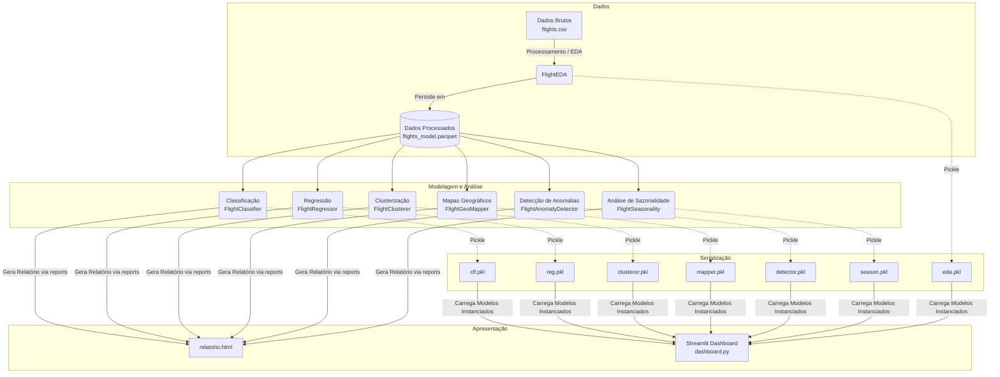

# Arquitetura do Sistema - Flight Delay ML

A arquitetura do projeto **Flight Delay ML** foi desenhada como um pipeline de dados *end-to-end* que abrange desde a extração e limpeza dos dados brutos até a disponibilização dos resultados através de um Dashboard interativo e relatórios estáticos.

## 1. Visão Geral da Arquitetura

O sistema é dividido em três camadas principais:
1. **Camada de Dados**: Armazenamento dos dados brutos em formato CSV e armazenamento otimizado dos dados processados em Parquet.
2. **Camada de Processamento e Modelagem**: Pipeline estruturado contendo módulos específicos para cada tipo de análise (Supervisionada, Não Supervisionada, EDA).
3. **Camada de Apresentação**: Dashboard interativo em Streamlit e geração de relatórios HTML estáticos.

## 2. Diagrama de Fluxo de Dados (Pipeline)

## 3. Descrição dos Componentes Principais

### 3.1. Orquestração (`main.py`)
O arquivo central atua como o orquestrador do pipeline de execução (ETL e ML). Ele é responsável por:
- Invocar e inicializar cada classe de análise de forma sequencial.
- Direcionar os resultados da modelagem para o módulo `reports` gerar o arquivo `relatorio.html` com métricas consolidadas.
- Executar a rotina `save_pickles()`, responsável por serializar as instâncias das classes em `outputs/pickles/`. Isso permite que o dashboard aproveite métricas previamente processadas sem executar o treinamento do zero.

### 3.2. Módulos de Machine Learning (`src/`)
- **`eda.py` (FlightEDA)**: Limpeza dos 5.7M de linhas de CSV, imputação, engenharia de features e persistência via pacote `pyarrow`/`fastparquet`.
- **`classificacao.py`**: Modelagem supervisionada binária (Ex: Logistic Regression, Random Forest).
- **`regressao.py`**: Modelagem supervisionada contínua para regressão dos minutos de atraso (Ex: Linear Regression, Decision Tree, LightGBM).
- **`clusterizacao.py`**: Clusterização multivariada de aeroportos usando algoritmos não-supervisionados como K-Means + PCA.
- **`mapa_geografico.py`**: Organiza as projeções em Plotly e Folium criando mapas coropléticos interativos.
- **`anomalias.py`**: Abordagem de Isolation Forest e LOF (Local Outlier Factor) para detectar distorções e atipicidades de tráfego aéreo.
- **`sazonalidade.py`**: Componente de agregação temporal para análise do calendário vs fluxo de cancelamentos e delays.

### 3.3. Front-end e Visualização
- **`dashboard.py`**: Interface construída usando **Streamlit**. O dashboard carrega diretamente os _pickles_ (estado pré-treinado dos objetos da pasta `outputs/pickles/`) otimizando massivamente o tempo de abertura e exploração da interface.
- **`reports/__init__.py`**: Script de exportação customizada para o relatório em HTML.

## 4. Decisões de Arquitetura e Desempenho
1. **Formato Parquet:** Migração dos dados processados de CSV para Parquet, possibilitando um carregamento centenas de vezes mais rápido e um *footprint* menor na RAM e em disco.
2. **Amostragem em Memória (`sample_frac`):** A execução do Random Forest e de SVMs em 5.7M linhas poderia causar `MemoryError`. A arquitetura estabeleceu samples dinâmicos (10% a 30%) durante Classificação e Regressão, mantendo a escalabilidade funcional do código num hardware padrão.
3. **Limpeza Pré-Pickling:** Antes do armazenamento em Pickle, atributos que possuam grandes DataFrames (como `self.df_model`) têm a referência limpa ou enviada para o Garbage Collector (`gc.collect()`). Isso reduz arquivos pickle que antes poderiam pesar dezenas de GBs para alguns poucos MBs ou KBs.
